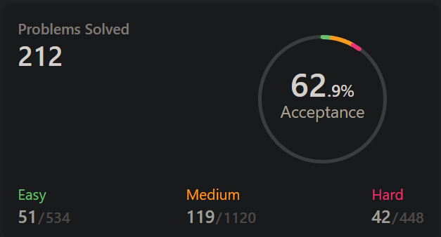

# My LeetCode Practice

Currently using Go and Python to solve the daily challenge.
### Continuing Update 
 * Now status: 262 problems solved
 * Total Acceptance Rate: 63.5%
 * Easy: 65 (77.1% Acceptance)
 * Medium: 148 (62.1% Acceptance)
 * Hard: 49 (54.7% Acceptance)  
(Update in 2022/02/01 with 21 more problems solved)  
  