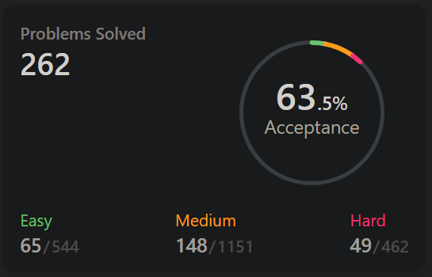

# My LeetCode Practice

Currently using C and JAVA to solve the daily challenge, and learning Go for future.
### Continuing Update 
 * Now status:
 * Total Acceptance Rate: 58.6%
 * Easy: 22 (71.1% Acceptance)
 * Medium: 63 (60.0% Acceptance)
 * Hard: 29 (49.4% Acceptance)
(Update in 08/24)
